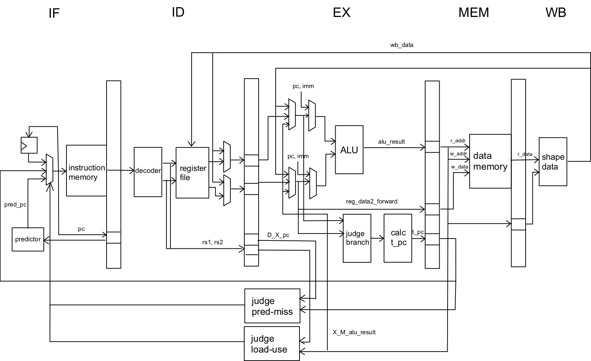

# verilog RISC-V processor

本プロジェクトでは，RISC-Vアーキテクチャに基づいたパイプライン型プロセッサと，それをさらに拡張したスーパースカラプロセッサの設計と実装を行った。

## 実装内容

### パイプライン型プロセッサ
- **5ステージのパイプライン構造**
  - Instruction Fetch, Instruction Decode & Register Read, Execution, Memory Access, Write Backの5ステージ。
- **データフォワーディング**
  - MEMステージおよびWBステージからのフォワーディングを実装。
- **ストール**
  - ロードユースハザード時，乗算・除算の実行中はそれより後のサイクルを停止させる。
- **分岐予測**
  - 2bitのbimodal分岐予測を実装。分岐予測失敗時はそれまでの命令を無効化。
- **M拡張対応**
  - 乗算・除算命令をサポート。複数サイクルかけて実行。

### スーパースカラプロセッサ
- 上記のパイプライン構造をベースに，2命令同時実行を可能にするスーパースカラ化を実装。

- **2命令同時実行判定回路の設計**
  - メモリ操作命令やRead After Write (RAW)ハザードを考慮した同時実行判定回路を設計。
- **レジスタファイルの改良**
  - 1サイクルで2つの書き込みを可能にするマルチポートレジスタを採用。
- **分岐予測の拡張**
  - 2命令分の分岐予測を行うように設計。

## 性能評価

### パイプライン型プロセッサ
- **動作周波数 :** 74MHz
- **Coremarkスコア :** 166
- **IPC (命令サイクルあたりの命令数) :** 0.65

### スーパースカラプロセッサ
- **動作周波数 :** 70MHz
- **Coremarkスコア :** 230
- **IPC :** 0.96
